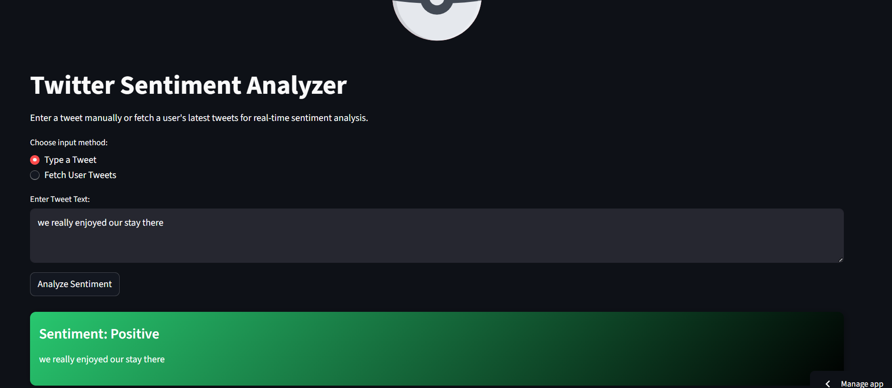

# Twitter Sentiment Analyzer

A real-time Twitter sentiment analysis tool that classifies tweets as Positive, Neutral, Negative, or Uncertain.  
Users can type a tweet manually or fetch a Twitter user's recent tweets for analysis. 
The app includes animated feedback, sentiment summary charts, and word cloud visualizations.



Live App on Streamlit: https://twittersentimentanalysis-fpzvuknctcdcjxvrvzugxf.streamlit.app

---

## **Table of Contents**
1. [Project Overview](#project-overview)  
2. [Dataset and Description](#dataset--description)  
3. [Data Cleaning & Preprocessing](#data-cleaning--preprocessing)  
4. [Modeling and Evaluation](#modeling--evaluation)  
5. [Installation](#installation)  
6. [Usage](#usage)  
7. [Project Structure](#project-structure)  
8. [Dependencies](#dependencies)  
9. [Future Work](#future-work).
10. [Acknowledgements](#Acknowledgements) 

---

## **Project Overview**
This project aims to analyze Twitter data and classify the sentiment of tweets.  
- **Input:** User-typed tweet or tweets fetched from a Twitter account  
- **Output:** Sentiment label (Positive, Neutral, Negative, Uncertain)  
- **Visualizations:** Word cloud and bar charts for sentiment summary  
- **Special Features:** Animated feedback using Lottie animations

---

## **Dataset and Description**
- **Source:** Twitter API (real-time tweets)  
- **Data Type:** Text (tweets)  
- **Key Features:**
  - text: The content of the tweet  
  - sentiment: Predicted sentiment label  
- **Suitability:** Ideal for NLP classification using TF-IDF and ensemble ML models.  
- **Number of Rows/Columns:** Rows= 691248, Columns = 2

---

## **Data Cleaning and Preprocessing**
- Remove non-alphabetic characters and special symbols  
- Tokenization and filtering unknown words
- Encoded sentiments  
- Feature engineering using TF-IDF vectorizer
- Handle ambiguous tweets by assigning "Uncertain" label  
- Prepared data is compatible with ML models like SVM and Logistic Regression

---

## **Modeling and Evaluation**
- **Model Type:** Ensemble of traditional ML classifiers (SVM + Logistic Regression + Decision Tree)  
- **Training:** Pre-trained on labeled tweet dataset  
- **Prediction:** Returns sentiment label and Sentiment strength 
- **Evaluation:** 
  - Accuracy, Precision, Recall, F1-score  
  - Confidence threshold for uncertain predictions  
  - Sentiment visualization via bar charts  
- **Special Handling:** Tweets without known vocabulary words → "Uncertain"

---

## **Installation**

```bash
1. # Clone repository
git clone https://github.com/Montwana/Twitter_Sentiment_Analysis.git
cd Twitter_Sentiment_Analysis

2. # Create virtual environment
python -m venv venv
source venv/bin/activate  # Linux/macOS
venv\Scripts\activate     # Windows

3. # Install dependencies
pip install -r requirements.txt

4. # Set environment variables
Create a .env file in the project root:
BEARER_TOKEN=your_twitter_api_bearer_token

5. # Usage
Run the app
streamlit run app.py
```
---

## **Choose input method**

Type a Tweet: Enter your tweet manually.

Fetch User Tweets: Provide a Twitter username (without @) and number of tweets to fetch.

View Results

Animated sentiment card for each tweet

Sentiment summary bar chart (number of tweets for fetched, sentiment strength for typed)

Word cloud visualization of tweet content

---

## **Project Structure**
```bash
├── app.py                  # Main Streamlit app
├── models/
│   ├── twitter_ensemble_model.pkl
│   └── twitter_vectorizer_ensemble.pkl
├── requirements.txt
├── README.md
└── .env
```

---

## **Dependencies**

Python 3.10+

Streamlit
 – Web app interface

Tweepy
 – Twitter API

Joblib
 – Model saving/loading

Pandas
 – Data manipulation

Matplotlib
 – Word cloud plotting

Plotly
 – Sentiment bar charts

WordCloud
 – Word cloud generation

Requests
 – Load Lottie animations

python-dotenv
 – Manage environment variables

streamlit_lottie
 – Animated Lottie visuals

 ---

## **Future Work**

Integrate deep learning models (BERT, RoBERTa) for better accuracy

Emoji and hashtag sentiment analysis

Multi-user dashboards and historical trends

---

## **Acknowledgements**

**Dataset:**

- Positive and Negative sentiments from Kaggle- https://www.kaggle.com/datasets/abhi8923shriv/sentiment-analysis-dataset?select=testdata.manual.2009.06.14.csv
         
- Neutrals from Github - https://github.com/laxmimerit
         
Twitter API for data access

LottieFiles for animation assets

Scikit-learn for ML models and TF-IDF


